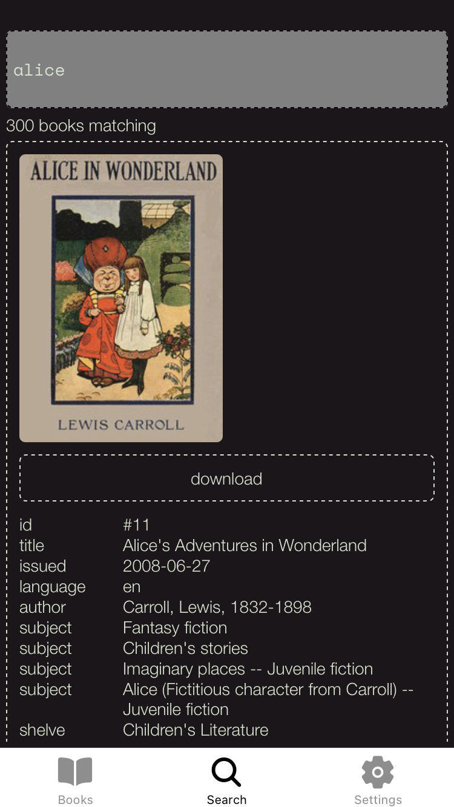
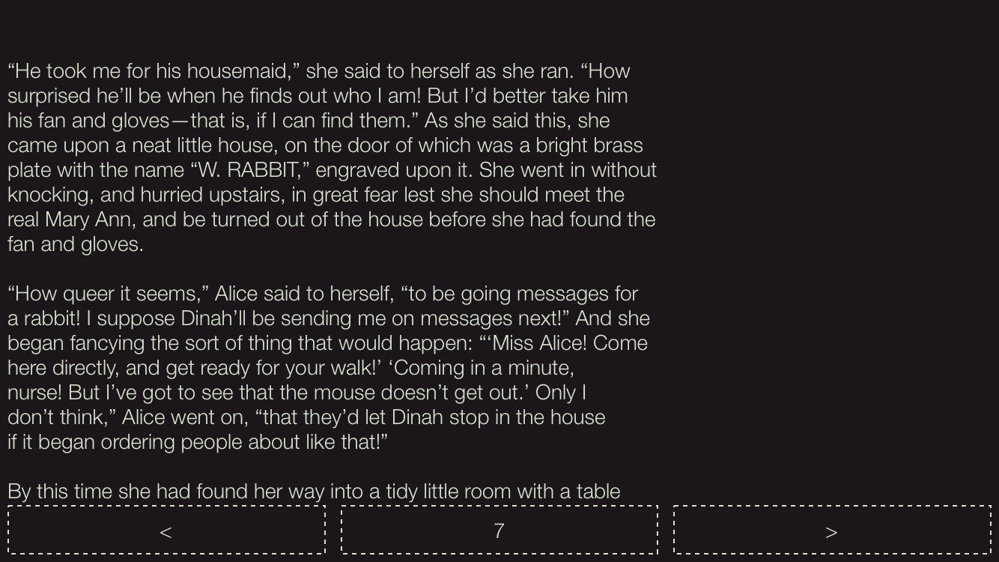
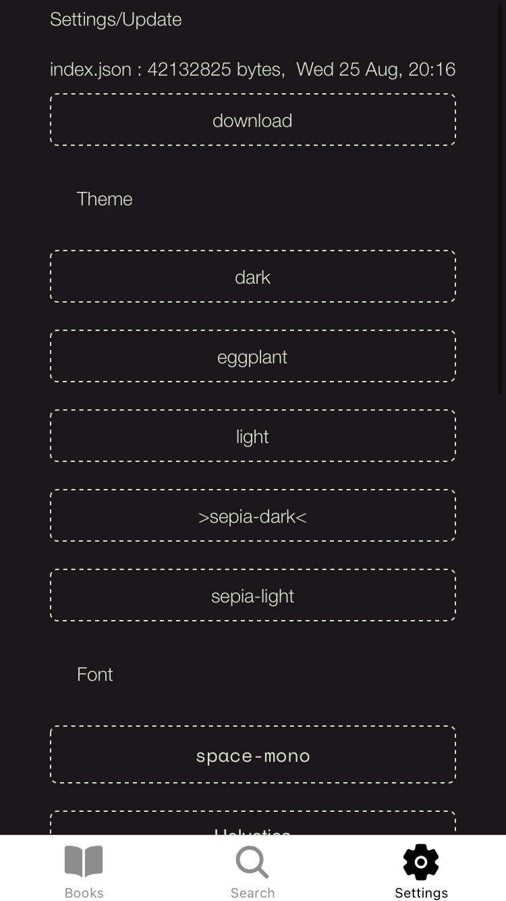

# punkjazz - https://expo.dev/@jackdoez/punkjazz

Offline reader and search for http://www.gutenberg.org project's books

The app downloads http://gutenberg.pglaf.org/cache/generated/feeds/pg_catalog.csv and indexes it using https://www.npmjs.com/package/paxx, stores the index locally and then uses it to search.

## Search

## Downloaded Books

## Reader

## Settings

